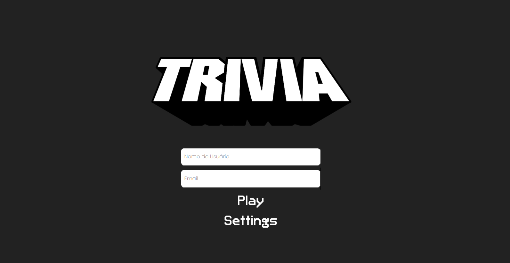

<h1>Projeto jogo de trivia</h1>

<h2>Habilidades desenvolvidas:</h2>
<ul>
  <li>Criar um store Redux em aplicações React</li>
  <li>Criar reducers no Redux em aplicações React</li>
  <li>Criar actions no Redux em aplicações React</li>
  <li>Criar dispatchers no Redux em aplicações React</li>
  <li>Conectar Redux aos componentes React</li>
  <li>Criar actions assíncronas na sua aplicação React que faz uso de Redux.</li>
</ul>

Projeto desenvolvido em: 18/04/2022

